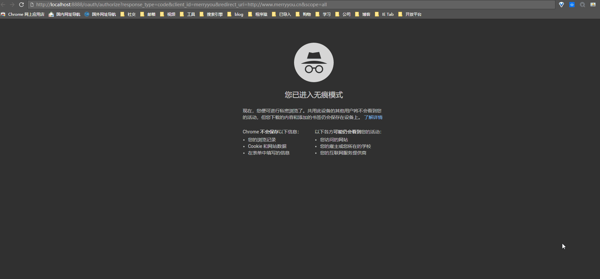
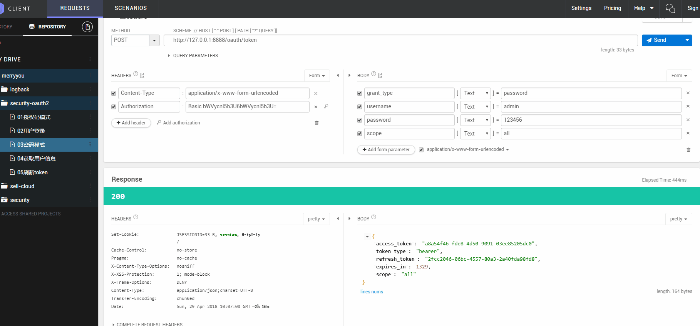
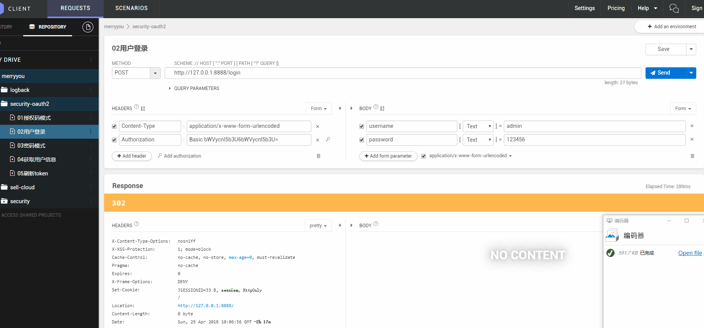
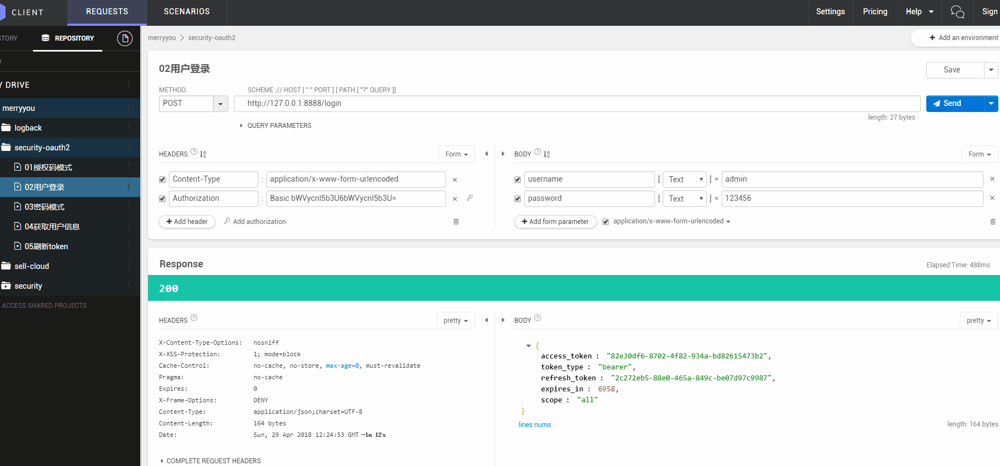
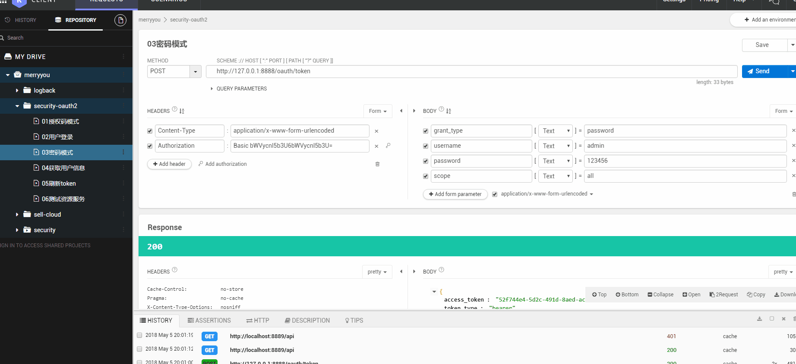

# oauth

### grant_type

- password 密码模式 使用账户密码登陆
- client_credentials 客户端模式（无用户模式）使用clientId & clientSecret登陆
- authorization_code 授权码模式(即先登录获取code,再获取token)
    - 1、使用`http://localhost:8081/auth/oauth/authorize?client_id=client1&redirect_uri=http://localhost:8082/ui/login&response_type=code`进入auth-server登陆
    - 2、登陆成功后，会跳转到`http://localhost:8082/ui/login&response_type=code`
    - 3、跳转后authserver会附带code参数，获取code参数
    - 4、使用code 调用`{auth-server}/oauth/token`进行安全认证，获取access_token。
- implicit 简化模式(在redirect_uri 的Hash传递token; Auth客户端运行在浏览器中,如JS,Flash)
    - 1、使用`http://localhost:8081/auth/oauth/authorize?client_id=client1&redirect_uri=http://localhost:8082/ui/login&response_type=token`进入auth-server登陆
    - 2、登陆成功后`http://localhost:8082/ui/login#access_token=415ac9ea-3b93-41c6-8819-17c583c280d9&token_type=bearer&expires_in=944&scope=all`
    - 3、直接使用accessToken即可完成后续登陆。

- refresh_token 使用`password` `authorization_code`方式登陆成功后，返回时会附带access_token与refresh_token，使用refresh_token可以刷新。

### oauth api

- authorization
http头中的authorization为 `Base64(clientId:clientSecret)` 客户端ID+ “:” + 客户端密钥

- auth server

| api                |      说明                          |  grant_type         |   header:Authorization    |
|--------------------|:----------------------------------:|-------------------:|---------------------------:|
| /oauth/token       |  密码方式获取token                  | password           |  "basic " + authorization |
| /oauth/token       |  授权码模式获取token                | authorization_code |  "basic " + authorization |
| /oauth/token       |  clientId & secret模式获取token    | client_credentials |  "basic " + authorization  |               
| /oauth/token       |  刷新token                         | refresh_token      | "basic "+ authorization  |
| /user/me           |  获取当前用户                       |                   |                          |
| /oauth/check_token |  校验token                         |                   |  "basic " + authorization |

- resource 

| api                |      说明                          |  grant_type         |   header:Authorization       |
|--------------------|:----------------------------------:|-------------------:|------------------------------:|
| xxx api            |   访问资源                          |                    |  tokenType +" "+ access_token |


# demo

## auth-client
org.fran.microservice.cas.authclient.client 目录下提供了全套的基于客户端的oauth认证。可以用于各开源认证服务、SDK调用。

测试：
- 启动auth-resource & auth-server-jdbc或 auth-server
- loginByPwd() 使用账户密码登陆获取token
- clientCredentials() 使用clientId & secret登陆获取token
- authorizationCode() 认证码方式获取token
- userInfo() 当前用户信息获取
- checkToken() 校验token过期
- resourceInvoke() 访问资源服务器
- refresh() 刷新token

## auth-sso
通过oauth grant_type：authorization_code方式，实现单点登陆

测试：
- 启动auth-sso、auth-server-jdbc或auth-server
- 访问http://localhost:8082/ui/ 点击login按钮
- 跳转至http://127.0.0.1:8081/auth/login 输入账户ed 密码1登陆
- 登陆成功后进入http://localhost:8082/ui/securedPage
- 修改auth-sso的application.yaml中的端口配置，在启动一台8083端口的服务
- 访问http://localhost:8083/ui/securedPage也可以免登陆访问

## auth-resource
资源服务，实际业务的api等，通过http://127.0.0.1:8088访问

可以通过httpclient，从auth-server获取token，使用token访问资源服务器进行资源操作。

## auth-server
oauth2 server，配置从配置文件读取，token保存在内存中

使用配置文件存储相关配置
```yaml
fran:
  security:
    oauth2:
      clients:
        - clientId: "client1"
          clientSecret: "client1secret"
          autoApprove: true
          redirectUris:
            - "http://localhost:8083/ui2/login"
            - "http://localhost:8083/ui/login"
            - "http://localhost:8082/ui/login"
            - "http://localhost:8082/ui2/login"

        - clientId: "client2"
          clientSecret: "client2secret"
          autoApprove: false
          redirectUris:
            - "http://localhost:8082/ui/login"

        - clientId: "client3"
          clientSecret: "client3secret"
          autoApprove: true
          redirectUris:
            - "http://localhost:8082/ui/login"
```

登陆server用户
```
用户账户：ed 密码：1
权限：USER_editor USER_copyeditor USER_chiefeditor
```


## auth-server-jdbc
oauth2 server jdbc样例，配置从服务器端获取

- 初始化auth_user相关数据库及数据
```
用户账户：ed 密码：1
权限：USER_editor USER_copyeditor USER_chiefeditor
```

- 初始化spring oauth2相关数据库及数据
```
clientId： client1
clientSecret：client1secret
clientSecret以MD5方式存储在`oauth_client_details`表中，添加新的client可以从中获取
```

# gif

### 授权码模式


### 密码模式


### 自定义登录


### 刷新token


### 测试资源服务器
